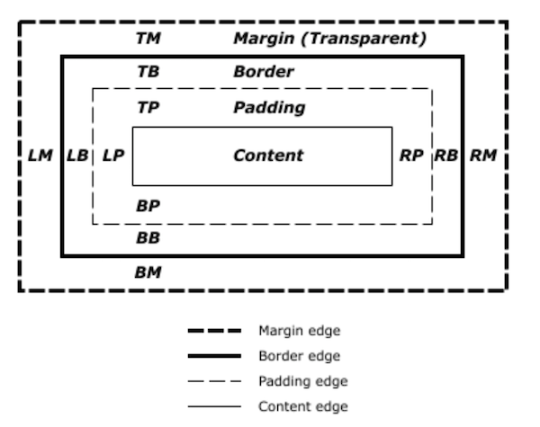

# CSS Fundamentals #

## CSS Intro ##

**Cascading Style Sheets (CSS)** is a stylesheet language used to describe the _presentation_ of a document written in HTML or XML. CSS describes how elements should be rendered on screen, on paper, in speech, or on other media.

Select the HTML element. 438+ properties - see: [CSS Properties Index](https://meiert.com/en/indices/css-properties/) for a list of properties maintained by Jens Oliver Meiert. See also: [MDN web docs: CSS reference - **keyword index**](https://developer.mozilla.org/en-US/docs/Web/CSS/Reference#Keyword_index)

Syntax:

	selector {
	  property: value;
	    "        "
	}

Remember to open `{` and close `}`. CSS is less forgiving than HTML to syntax errors - remember also `:` and `;`

Example of some CSS:

	body {
	  background-color: red;
	}

## Basic styling ##

### Selectors ###
	
Selectors can be HTML element, class, id, or complex: 

* HTML type selector selects all elements that match the given node name
* ID selector selects an element based on the value of its `id` attribute. There should be only one element with a given ID in a document.
* Class selector selects all elements that have the given `.class` attribute

Use `class` for the sake of consistency and because `id` holds a lot of weight

`class` starts with `.`, `id` starts with `#`

### Background - there are lots... ###

`background-color:`, `background-image:`, `background-repeat:`, `background-position:`

`background:` is shorthand e.g. `background: transparent url('myimage.png') no-repeat top left;`

This is common - lot's of properties have shorthand

scrolling - `background-attachment: scroll`

background bounds - `background-clip: padding-box`

You can have a gradient as a background image `linear-gradent()`, plus other CSS functions e.g. `word()`, `url()` which points to a resource, such as an image or a font used in CSS properties such as `background-image`

See: [MDN web docs: **url** data type](https://developer.mozilla.org/en-US/docs/Web/CSS/url) and [MDN web docs: **linear-gradient()** function](https://developer.mozilla.org/en-US/docs/Web/CSS/linear-gradient)

### Borders ###

Tip to see where the boxes are - add a border e.g. `border: 1px solid blue;` 

Border is shorthand e.g. `border: 1px solid red` shorthand for `-width: 1px`, `-style: solid`, `-color: red`

Box shadow is NOT shorthand `box-shadow: 1px 1px 1px 0px grey` - `<offset-x>` `<offset-y>` set the shadow offset in this example bottom & right offsets of `-1px -1px` would give shadow left & top. Other values are `<blur-radius>`, `<spread-radius>` and `<color>`

`border-radius` is shorthand - rounds the corners of an element's outer border edge

`border-radius: 10px` is shorthand for `tl: 10px;` `tr: 10px;` `br: 10px;` `bl: 10px;` - all four corners

`border-radius: 10px 20px 30px 40x` is shorthand for `tl: 10px;` `tr: 20px;` `br: 30px;` `bl: 40px;`

`border-radius: 10px 20px` is shorthand for `tl: 10px` `br: 10px` `tr: 20px` `bl: 20px`

`border-radius: 10px 20px 30px` is shorthand for `top-left: 10px` `top-right-and-bottom-left: 20px` `bottom-right: 30px`

See: [MDN web docs: **border-radius** CSS property](https://developer.mozilla.org/en-US/docs/Web/CSS/border-radius)

### Selectors (again) ###

Type selector use HTML `element name` e.g. `header`, classes selector start with `.` e.g. `.classname`, id selector starts with `#` e.g. `#idname` - there's also _universal selector_ and _attribute selector_

See: [MDN web docs: **CSS selectors**](https://developer.mozilla.org/en-US/docs/Web/CSS/CSS_Selectors#Basic_selectors)

To style two things the same use a comma e.g. `.header-main, section { ... `

To target a child use a space e.g. `.header-main nav li { ...` - selects parent (`.header-main`) child (`nav`) child (`li`)

Link to [CSS Intro](https://gitpitch.com/develop-me/fellowship-wk1-beg-html-css?p=day02/01CSSIntro#/) presentation

### Exercise 1 - use the styles you have learnt ###

Use `background` `border` `box-shadow` `border-radius`

- - - -

## CSS Colours Formats ##

Color names - [X11 color names](https://en.wikipedia.org/wiki/X11_color_names)

Hex values - RGB channels e.g. #000 - black, #FF0000 - red, #FFF - white, #555 - grey

RGB - `rgb()` function - 0 - 255 e.g. `rgb(255, 255, 255)` - white

RGB with alpha - `rgba()` function with alpha channel - (0 - transparent, 1 - opaque)

HSL - `hsl()` function e.g. `hsl(100, 50%, 50%)` - hue, saturation, lighness - h = 0-360 degrees, s & l = 0-100%

HSL with alpha - `hsla()` function e.g. hsla(200, 50%, 50%, 0.5) h, s, l, plus a = 0 - 1 opacity (0 - transparent, 1 - opaque)

Link to [CSS Colour formats](https://gitpitch.com/develop-me/fellowship-wk1-beg-html-css?p=day02/02CSSColours#/) presentaion

- - - -

## CSS Box Model ##

The **CSS box model** is the foundation of layout on the Web - each element is represented as a rectangular box, with the box's content, padding, border, and margin built up around one another like the layers of an onion. As a browser renders a web page layout, it works out what styles are applied to the content of each box, how big the surrounding onion layers are, and where the boxes sit in relation to one another. 

Every element has a default set of styles

Common default `display` values are `block` & `inline` e.g. sectioning elements are `block`, text elements are `inline`. See [MDN web docs: **Block-level elements**](https://developer.mozilla.org/en-US/docs/Web/HTML/Block-level_elements#Elements) and [MDN web docs: **inline elements**](https://developer.mozilla.org/en-US/docs/Web/HTML/Inline_elements#Elements)

* An image is `display: inline;`
* A list `display: list-item` but actually special kind of `block`
* A table is `display: block;`

Note that spec is changing - see: [MDN web docs: **display**](https://developer.mozilla.org/en-US/docs/Web/CSS/display)

* `width: 50%;` - changes width of an element
* `margin: 5px;` - sets the margin outside of the content
* `padding: 10px;` - sets poadding inside the content
* `border: 2px;` adds a border to the content

The `box-sizing` CSS property defines how the browser calculates the total width and height of an element. See: [MDN web docs: **box-sizing** CSS property](https://developer.mozilla.org/en-US/docs/Web/CSS/box-sizing)

* `content-box` gives the default CSS box-sizing behavior
* `border-box` tells the browser to account for any border and padding in the values specified for an element's width and height.

The `width` CSS property specifies the width of an element. By default, the property defines the width of the content area. If box-sizing is set to `border-box`, however, it instead determines the width of the border area.

* `min-width` sets the minimum width of an element. It prevents the _used value_ of the width property from becoming smaller than the value specified.
* `max-width` sets the maximum width of an element. It prevents the used value of the width property from becoming larger than the value specified.
* The [_used value_](https://developer.mozilla.org/en-US/docs/Web/CSS/used_value) of a CSS property is its value after all calculations have been performed on the _computed value_. 
* The [_computed value_](https://developer.mozilla.org/en-US/docs/Web/CSS/computed_value) of a CSS property is the value that is transferred from parent to child during inheritance.

Content gives a box it's height so there's no need to specify a height

When changing something by, say, 50% make room with padding and margins (not height)

Sometimes with icons you want to specify a height

Padding & margin on inline elements doesn't act the same way as the block elements it doesn't move things up/down

To specify that two block level elements act like inline use `inline-block` (best of both world) - padding and margin work as expected

`inline` elements have 'magical white space' between them - which can be removed using comments in HTML (not CSS)

See: [W3C Working Draft CSS2.2 Box Model](https://www.w3.org/TR/CSS22/box.html)

Link to [CSS Box Model](https://gitpitch.com/develop-me/fellowship-wk1-beg-html-css?p=day02/03CSSboxModel#/) presentation

- - - -

## Exercise 2 ##

Make your page look like the picture `03ex02.png` with the things you have learnt

### Exercise 2 - Review ###

Tip - put a border around everything to see where the boxes are

Use `padding` more than `margin` 

`margin` is useful because it collapses in on itself - so not 2 x `10px` margin but 1 x `10px` (as long as they're direct children)

Avoid styling on the `<body>` use `
` instead to target `<body>`

To centre whole page target `
` wrapping the `<body>` and set the margin to `0px` top & bottom, `auto` left & right - `margin: 0px auto;`

- - - -

##CSS Sizing units

Pixels (`px`)

* `margin: 10px;`
* 1px = 1 screen pixel 
* not quite on Retina screens - workaround with `<meta name="viewport" ..`
* px - absolute measures, fixed, not responsive

Percentage (`%`)

* `div {width: 50%;}`
* percentage of container - always a width
* Not height, which is set by content

Ems (`em`)

* font measurement - relative to parent 1em = 16px (default)
* e.g. `p {font-size: 1.2em;} /* 16 x 1.2 */`
* e.g. `p a {font-size: 1.2em;} /* 16 x 1.2 x 1.2 */` (parent)

Rems (`rem`)

* Like `em` but always relative to root html `(:root)` element
* e.g. `p {font-size: 1.2rem;} /* 16 x 1.2 */`
* e.g. `p a {font-size: 1.2rem;} /* 16 x 1.2 */`

Viewport (`vw`, `vh`)

* Viewport-percentage lengths define the `<length>` value relative to the size of the viewport, i.e., the visible portion of the document.
* e.g. `section {height: 100vh;}`
* `1vw` = 1% of width of the viewport's (initial containing block)
* `1vh` = 1% of the height of the viewport's (initial containing block)
* `1vmin` = `1vw` or `1vh` whichever is smaller
* `1vmax` = `1vw` or `1vh` whichever is larger
	
Others

* Font relative lengths
	* `ex` - represents the x-height of the element's font
	* `ch` - represents the width of "0" (zero) in the element's font
	* `lh` - equal to the computed value of the line-height property of the element
* Absolute length units
	* `pt` - 1 point. `1pt` = 1/72nd of 1in.
	* `mm` - 1 millimeter
	* `cm` - 1 centimeter. `1cm` = `96px/2.54`

See: [MDN web docs: The **length** CSS data type ](https://developer.mozilla.org/en-US/docs/Web/CSS/length)

###Position

By default everything is `position: static;` 

`position: relative;` - left, top, bottom, right - these lose the vertical flow

`position: fixed;` - out of the flow of the document - good for sticky headers - set location with left, top, bottom, right - relative to the body unless parent has coordinate system with `postion: relative`

`position: absolute;` - same as fixed (jumped out of flow & coord system) but doesn't scroll

###Transforms

Transform property e.g. `transform: rotate(30deg)` 

###Floats

Get images and text to flow around elements e.g `float: right;`

One float simple to use - lots of floats gets tricky 

When you float something it jumps out of the flow (the DOM), the box so use `overflow: auto` property on parent (not supposed to used for this but...) - repaints container

Tips - rarely use `clear` one thing on left one thing on right with 50% width

Remember width includes padding unless using `border-box`

Link to [CSS Sizing Units](https://gitpitch.com/develop-me/fellowship-wk1-beg-html-css?p=day02/05CSSSizing#) presentation

- - - -

##Exercise 3 ##

Use `float` in the `<header>` to get the `<nav>` element to float 

- - - -

## Talk of the day

Where does CSS come from? - Rachel Andrew at CSS conf EU 2017 [https://youtu.be/cYGOv2ToZjY](https://youtu.be/cYGOv2ToZjY)

Where does CSS come from?

Don't break the web - backward compatibility

Where does CSS come from __today?__

W3C Cascading Style Sheets - [https://www.w3.org/Style/CSS/Overview.en.html](https://bit.ly/2qzIUMS)

CSS Grid - [https://www.w3.org/TR/css-grid-1/](https://bit.ly/2H01Ued)

- - - -

## Responsive & Adaptive Design

Responding to the environment - e.g. resize to device

Adapting to the device - e.g. serving different sets of files for different devices or connections (less used today)

Designs that work in all environments - screens, inside/outside, noisy/quiet, fibre/2G

###How?

Use relative not absolute units

CSS Media Queries - detect the size of the screen

JS feature & device detection

Speedtesting is hard

###Media queries - different types of media, like print

`@media print { ... }`

Breakpoints like viewport width e.g. `@media only screen and (max-width: 500px) { ... }`

For example:

    /* Extra small devices (phones, less than 768px) */
    @media (max-width: 767px) { ... }

    /* Small devices (tablets, 768px and up) */
    @media (min-width: 768px) and (max-width: 991px) { ... }

	/* Medium devices (desktops, 992px and up) */
	@media (min-width: 992px) and (max-width: 1199px) { ... }

	/* Large devices (large desktops, 1200px and up) */
	@media (min-width: 1200px) { ... }

###JS feature & device detection

JS libraries to detect

* device type
* touchscreen or desktop
* operating system
* browser

Can add class to body with JavaS

* e.g. `<body class=“touchscreen tablet windows8 w1024”>`

Can even detect orientation

	<body class=“dim-short-600 dim-long-1024 portrait”>
	<body class=“dim-short-600 dim-long-1024 landscape”>

Modernizr is a small piece of JavaScript code that automatically detects the availability of next-generation web technologies in your user's browsers. See: [modernizr.com](https://modernizr.com/)

Use CSS where possible - cleaner, faster and easier to maintain using CSS-only approach and media queries.

###Planning Responsive Layout

Consider hierarchy and navigation - e.g. _burger icon_

* What content is most important? What should come first?
* How can we navigate?
* Is some content worth losing for a simplified mobile experience? e.g. video, slideshow.

Usually media queries at the bottom because the CSS you write last get added last - the 'cascade'

Further reading 

* [Responsive Web Design Is...](https://responsivedesign.is/)
* Wikipedia [Responsive web design](https://en.wikipedia.org/wiki/Responsive_web_design)

Link to [Responsive & Adaptive Design](https://gitpitch.com/develop-me/fellowship-wk1-beg-html-css?p=day02/04responsive#/) presentation

- - - -

###Exercise 4

use `@media only screen ... ` to create a responsive (to resize) design

- - - -

###Additional resources:

* [Learn CSS Layout](http://learnlayout.com/)
* CSS-Tricks [All About Floats](https://css-tricks.com/all-about-floats/)

* Homework - watch [Basics of Photoshop #01 - What Does Everything Do?](https://www.youtube.com/watch?v=SafSh_u1FF0)

